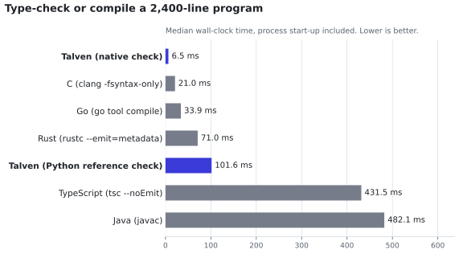

  

<h1 align="center">Talven</h1>

<em>Clarity down to the machine.</em>

  
  
  

Talven (pronounced **TAL-ven**) is an experimental native programming language designed first for **AI coding agents**, while staying clear for humans. It aims for the safety of Rust, the control of C, and a small, regular syntax that a model can learn from one page, with a compiler that hands agents exactly the context they need.

> **Status: early prototype.** A working reference compiler implements a small subset: types, moves, borrowing, text output, a formatter, an LSP, and native builds through C11. It is not ready for production use. [What works today](#what-works-today) lists exactly what exists.

## Why Talven

AI agents now write a large share of systems code, but today's languages were designed for people reading on screens. Agents pay for every token of documentation, every unclear error, and every failed repair. Talven's goal is to **lower the total cost of a correctly completed coding task**, measured in tokens, repairs, and verification, without giving up native performance or memory safety.

That means:

- **A language small enough to learn from one page.** The entire implemented language fits in a [one-page reference](docs/language-reference.md).
- **Compiler output built for agents.** The compiler returns structured diagnostics, bounded context for one symbol at a time, and edit previews checked against an exact source revision.
- **Safety without a garbage collector.** Values move, borrows are checked, and arithmetic overflow traps instead of silently wrapping.
- **Native and small.** Programs compile ahead of time, and a freestanding program can be under 3 KB.

## A taste

~~~text
struct Counter {
    value: i32
}

fn read(c: &Counter) -> i32 {
    return c.value;
}

fn add(c: &mut Counter, amount: i32) -> i32 {
    c.value = c.value + amount;
    return c.value;
}

fn main() -> i32 {
    let mut counter = Counter { value: 40 };
    add(&mut counter, 2);
    if (read(&counter) == 42) {
        return print("ok\n");
    }
    return 1;
}
~~~

`&` lends read access and `&mut` lends exclusive write access, each only for the duration of a call. The compiler rejects overlapping loans, use after a move, and implicit conversions, and it reports each rejection with a stable error code and an exact source range.

## Evidence so far

| | Result |
| --- | --- |
| **Agents** | From the one-page reference alone, Claude Opus 5.5 passed **80 of 80** trials on the first attempt, including tasks built to trip up habits from Rust, C, and TypeScript. Sonnet 5 and Haiku 4.5 passed **95 of 96** after repairs. That cost **$0.02–0.04 per task** at list price |
| **Context** | Compiler context for one symbol stayed at **~1.5 KB** while the source grew 4× |
| **Speed** | The native checker handles a **2,400-line** program in about **4–7 ms**, including process start-up. That is faster than `clang`, `go`, `rustc`, `javac`, and `tsc` checking the same program |
| **Run time** | Compiled programs run at native speed with overflow checks: level with Go on recursive `fib(35)`, ahead of Java and TypeScript |
| **Size** | Hello World is a **33 KB** executable with no runtime to install; a program with no libc links to **2,800 bytes** |
| **Correctness** | 270+ tests, a 651-case differential suite between two independent compilers, and sanitizers, with CI on Linux x86-64 and ARM64 |

<picture>
  <source media="(prefers-color-scheme: dark)" srcset="docs/assets/benchmarks/check-dark.svg">
  
</picture>

Every number links to a reproducible record, along with its limits, in [Benchmarks and evidence](docs/benchmarks.md). That page also compares run time and footprint with C, Rust, Go, Java, and TypeScript.

## Quick start

You need Python 3.11+ and a C11 compiler available as `cc`. There is nothing to install.

~~~sh
git clone https://github.com/TechiesApp/talven.git && cd talven

python3 -m talven build examples/hello.tal --console -o build/hello
./build/hello                                    # Hello, world!

python3 -m talven check examples/borrowing.tal   # type, move and borrow checking
python3 -m talven fmt examples/vectors.tal --check
python3 -m talven context examples/vectors.tal --symbol dot   # agent context for one function
python3 -m talven dev examples/hello.tal --console            # rebuild and restart on save
~~~

Run the test suite with `python3 -m unittest discover -s tests`. For editor support, point an LSP client at `python3 -m talven lsp`.

## What works today

| Area | Implemented |
| --- | --- |
| Language | `i32`, `bool`, static UTF-8 `str`, functions, `let`, `if`/`else`, records of scalars, checked arithmetic |
| Safety | Affine moves, call-scoped `&`/`&mut` borrows, field mutation, strict types, overflow and division traps |
| Tooling | `check`, `fmt`, `context`, `build`, `emit-c`, `dev` (watch and restart), `edit` previews, and an LSP |
| Targets | Native executables through C11 on Linux x86-64 and ARM64 (in CI) and macOS; a no-libc Linux mode |
| Agent evaluation | A reproducible harness with paired source-only and compiler-context conditions, independent native acceptance, and priced token accounting |
| Native compiler | A Rust prototype of the scalar, text, and by-value record subset (no borrowing yet), kept identical to the reference by a differential suite |

Not built yet: loops, heap allocation, generics, modules, concurrency, a package manager, and GPU backends. See the [roadmap](docs/roadmap.md).

## Where it is going

The [requirements](docs/requirements.md) set the long-term direction, and the [roadmap](docs/roadmap.md) stages it behind evidence gates:

- **Agent-first tooling:** precise edits, cached context, and an excellent LSP, all driven by one compiler model.
- **Memory and concurrency:** explicit allocators, structured tasks, and cancellation, with no mandatory garbage collector.
- **A fast native compiler:** incremental builds and hot reload during development.
- **Interoperability:** C libraries first, then selected managed ecosystems, with the cost of each bridge made explicit.
- **Hardware:** ARM64 and x86-64 first, then explicit GPU memory and one GPU backend.

## Contributing

Talven is at the stage where one contribution can shape the language. Good places to start:

- **Harder agent tasks.** The first pilot hit a ceiling; the harness needs tasks that models fail without compiler help. See [experiments](experiments/README.md).
- **The native compiler.** Port records and borrowing to the [Rust prototype](experiments/native-compiler/README.md). The differential suite tells you when it matches the reference.
- **Editor support.** Completion, semantic tokens, and incremental parsing in the LSP.
- **Language design.** Loops, allocation, and error handling go through [design proposals](docs/proposals/README.md).

Read [CONTRIBUTING.md](CONTRIBUTING.md) for setup, checks, and the pull-request process. The [documentation index](docs/README.md) lists every guide, design document, and evidence record.

## License

Talven is licensed under the [Apache License 2.0](LICENSE). Contributions are accepted under the same license with a [DCO](https://developercertificate.org/) sign-off (`git commit -s`). Copyright is held by the company named in [NOTICE](NOTICE).
