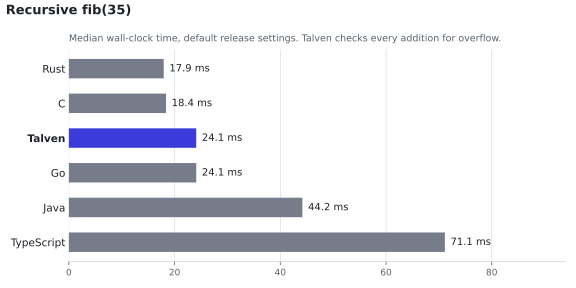
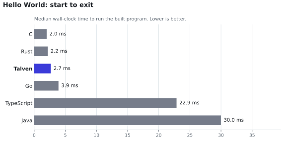
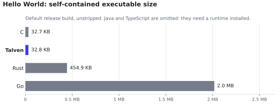

# Benchmarks and evidence at a glance

Talven is early. This page gathers the measurements it has so far, so you can judge whether the direction is worth your time. Every number here comes from a committed, reproducible record linked in its section. Each section also says what the number does **not** show.

## Summary

| Question | Measured answer | Source |
| --- | --- | --- |
| Can a current model work in Talven from one page of documentation? | Claude Opus 5.5 passed **80 of 80** trials on the first attempt, including a corpus built to trip up habits from other languages, at **$0.02–0.03 per task** at list price | [Agent pilot](#agents-can-use-it-today) |
| How does it compare with C, Rust, Go, Java, and TypeScript? | Fastest checker on a 2,400-line program (**6.5 ms**), native run time level with Go, 33 KB executables with no runtime | [Comparison](#compared-with-popular-languages) |
| How much prompt does the language itself cost? | The whole system prompt, including the language reference, is about **3,900 tokens** | [Agent pilot](#agents-can-use-it-today) |
| Does compiler context stay small as programs grow? | Selected-symbol context stayed at **~1.5 KB** while source grew **4×** (2.2 KB to 8.6 KB) | [Bounded context](#compiler-context-stays-bounded) |
| How fast is the native checker? | Checks a **2,400-line** program in **4.1 ms** end to end, start-up included | [Checker speed](#native-checker-speed) |
| How small can programs be? | A no-libc Linux program links to **2,800 bytes** with **1,072 bytes** of code | [Footprint](#small-freestanding-programs) |
| Is the implementation trustworthy? | 270+ tests, a **548-case** differential suite between two independent compilers, sanitizers, and CI on Linux x86-64 and ARM64 | [Correctness](#correctness-investment) |

## Agents can use it today

**Record:** [pilot evidence](pilot-evidence.md) and its [archived runs](../experiments/results/pilot-opus-5-5-20260924/).

Claude Opus 5.5, effort `high`, received only the one-page [language reference](language-reference.md), a task, and the source. Every task was accepted by independent native tests, not by the compiler under test.

| Corpus | Trials | First-attempt passes | Input tokens per call (mean) | List-price cost |
| --- | --- | --- | --- | --- |
| Records, moves, types, refactors | 8 | 8 | 4,943 | $0.146 |
| Shared and exclusive borrowing | 8 | 8 | 5,225 | $0.184 |
| Hard corpus: habits other languages allow (2 efforts × 2 repetitions) | 64 | 64 | 5,922 | $1.790 |

About 3,900 tokens of each call were the cached system prompt (31,160 cache-read tokens over 8 calls per corpus): the model learned a new language from that much text. Costs are list-price equivalents; the run used a subscription.

The hard corpus asks for code where habits from other languages fail in Talven: loops, shadowing, `else if`, implicit reborrows, and overflowing intermediates. It includes one repair of six such errors at once, done without any compiler diagnostics in the source-only condition. The model avoided every trap.

**Limits.** One model. Every trial passed in both conditions, so these runs show the language is learnable, not that compiler context helps: at this program size, context cost about 20% more input tokens for no gain. See [next steps](pilot-evidence.md#next-steps).

## Compiler context stays bounded

**Record:** [tooling baseline](tooling-baseline-evidence.md) (Linux ARM64, 8 September 2026).

`talven context --symbol` returns a checked, deterministic summary of one function and its direct dependencies instead of the whole file.

| Workload | Source bytes | Selected context bytes |
| --- | --- | --- |
| Chain 32 | 2,170 | 1,554 |
| Chain 128 | 8,563 | 1,560 |

Source grew about four times; the context an agent needs for the edit did not. This is the mechanism behind the product goal of lower cost per task.

**Limits.** Bytes, not tokens, on synthetic call chains. Whether smaller context improves agent success is exactly what the harder corpus must test.

## Native checker speed

**Record:** [`frontend-benchmark-macos-arm64-20260924.json`](../experiments/results/frontend-benchmark-macos-arm64-20260924.json), produced by [`scripts/benchmark-frontends.py`](../scripts/benchmark-frontends.py) on macOS ARM64 (Python 3.14.7, Apple clang 21, rustc 1.96). The workloads are generated programs of scalar functions with arithmetic, conditionals, and calls, up to the prototype's token limit. Values are wall-clock medians of 9 runs after a warm-up.

| Program | Talven native, end to end | Talven Python reference, in-process | `clang -fsyntax-only` (equivalent C) | `rustc --emit=metadata` (equivalent Rust) |
| --- | --- | --- | --- | --- |
| 10 functions, 83 lines | 4.4 ms | 0.9 ms | 15.4 ms | 25.8 ms |
| 100 functions, 803 lines | 4.1 ms | 8.5 ms | 16.0 ms | 35.5 ms |
| 300 functions, 2,403 lines | 4.1 ms | 26.8 ms | 18.9 ms | 54.8 ms |

The native time is almost entirely process start-up: it barely changes between 83 and 2,403 lines. The Python reference is the specification-grade implementation; it scales linearly and is fine for today's program sizes.

**Limits.** Clang and rustc do more work for richer languages, include standard-library or header processing, and start larger processes, so their columns give scale rather than a like-for-like race. The native prototype covers scalars and text only, not records or borrowing. One host, one run.

## Small freestanding programs

**Record:** [freestanding validation](freestanding-validation.md) (Linux ARM64, GCC 12, no libc, no allocator).

| Build | Executable bytes | Code (text) bytes |
| --- | --- | --- |
| `-O2`, success path | 2,800 | 1,072 |
| `-O2`, trap path | 2,464 | 736 |

Checked arithmetic and traps are included; nothing else is linked. This supports the goal of a small freestanding core.

## Compared with popular languages

**Record:** [`language-benchmark-macos-arm64-20260924.json`](../experiments/results/language-benchmark-macos-arm64-20260924.json), produced by [`scripts/benchmark-languages.py`](../scripts/benchmark-languages.py) and charted by [`scripts/plot-benchmarks.py`](../scripts/plot-benchmarks.py).

**Setup.** Each language gets equivalent programs, built with its default release settings.
- **Host:** macOS ARM64.
- **Toolchains:** Apple clang 21, Rust 1.96, Go 1.27.1, Java 17.0.12, Node 22.18 with TypeScript 5.9.3.
- **Measurement:** medians of 15 runs after a warm-up, with process start-up included. Every run's output was checked.

### Check or compile speed

<picture>
  <source media="(prefers-color-scheme: dark)" srcset="assets/benchmarks/check-dark.svg">
  
</picture>

The same 300-function program, about 2,400 lines, in each language. Talven's native checker finishes first, and most of its 6.5 ms is starting the process. The Python reference is the specification-grade implementation, not the one meant to be fast.

### Run time

<picture>
  <source media="(prefers-color-scheme: dark)" srcset="assets/benchmarks/fib-dark.svg">
  
</picture>

Talven lowers to C, so it runs at native speed. It pays a small cost that C and release-mode Rust do not: **every addition is checked for overflow and traps instead of silently wrapping**. On this call-heavy workload that puts it level with Go, about 30% behind unchecked C, and ahead of the JIT-compiled runtimes, whose times include JVM and Node.js start-up.

### Start-up and footprint

<picture>
  <source media="(prefers-color-scheme: dark)" srcset="assets/benchmarks/hello-time-dark.svg">
  
</picture>

<picture>
  <source media="(prefers-color-scheme: dark)" srcset="assets/benchmarks/hello-size-dark.svg">
  
</picture>

A Talven program is a plain native executable with no runtime to install: it starts in under 3 ms and Hello World is 33 KB. Java and TypeScript ship a few hundred bytes but need a JVM or Node.js on the machine, so they are left out of the size chart. A freestanding Talven program [without libc](#small-freestanding-programs) is smaller still.

### Full results

| Language | Check or compile, 2,400 lines | Hello World run | Hello World artifact | fib(35) |
| --- | --- | --- | --- | --- |
| **Talven** | **6.5 ms** native (4.2–9.7) · 101.6 ms Python reference | **2.7 ms** | **32.8 KB** executable | **24.1 ms** (22.5–28.9) |
| C | 21.0 ms `clang -fsyntax-only` | 2.0 ms | 32.7 KB executable | 18.4 ms |
| Rust | 71.0 ms `rustc --emit=metadata` | 2.2 ms | 454.9 KB executable | 17.9 ms |
| Go | 33.9 ms `go tool compile` | 3.9 ms | 2.0 MB executable | 24.1 ms |
| Java | 482.1 ms `javac` | 30.0 ms | 412 B class + JVM | 44.2 ms |
| TypeScript | 431.5 ms `tsc --noEmit` | 22.9 ms | 41 B JavaScript + Node.js | 71.1 ms |

**Limits.**
- **Different work.** Talven's checker handles a much smaller language, while the other compilers check or compile richer ones: generics, classes, modules, and standard libraries.
- **Start-up costs differ.** Java and TypeScript include JVM and Node.js start-up, which JIT warm-up would amortize in long-running programs.
- **Uneven output.** `javac` and `go tool compile` produce output, while the other check rows do not.
- **One host, one run.** Background load was not isolated: another build ran part of the time.
- **Scalar programs only.** The generated programs use only scalar functions, and the native checker covers only this subset.

Read the table as the scale of each toolchain on small programs, not as a ranking of languages.

## Correctness investment

- **Two compilers, one behavior.** The Python reference and the Rust prototype are compared on 548 cases (examples, 116 hand-written edge cases, 160 random programs, 260 mutations): diagnostics must match code, message, and range, and emitted C must be byte-identical and run identically.
- **Sanitizers.** Borrowing and text lifetimes run under ASan and UBSan.
- **Test coverage.** The reference suite has 270+ tests and runs in CI on Linux x86-64 and ARM64 with no skips allowed.

## Reproduce

~~~sh
# Native checker comparison (needs Rust 1.96 via rustup; clang/rustc optional)
cargo build --release --manifest-path experiments/native-compiler/Cargo.toml
python3 scripts/benchmark-frontends.py --native experiments/native-compiler/target/release/talven-native \
  --sizes 10,100,300 --out build/frontend-benchmark.json

# Comparison with C, Rust, Go, Java and TypeScript (needs each toolchain and a TypeScript compiler)
python3 scripts/benchmark-languages.py --native experiments/native-compiler/target/release/talven-native \
  --tsc "$(command -v tsc)" --repetitions 15 --out build/language-benchmark.json
python3 scripts/plot-benchmarks.py build/language-benchmark.json --out build/charts

# Offline tooling baseline
python3 scripts/measure-tooling.py --out build/tooling-baseline

# Agent pilot (requires a signed-in Claude Code CLI; spends subscription usage)
python3 experiments/adapters/claude_code_cli.py --write-config build/cli.json --model claude-opus-5-5 --effort high
python3 -m experiments run --adapter build/cli.json --max-cost-usd 10 --out build/pilot
~~~

Report the host, tool versions, and every sample with new results; see [AGENTS.md](../AGENTS.md) for the evidence rules.
